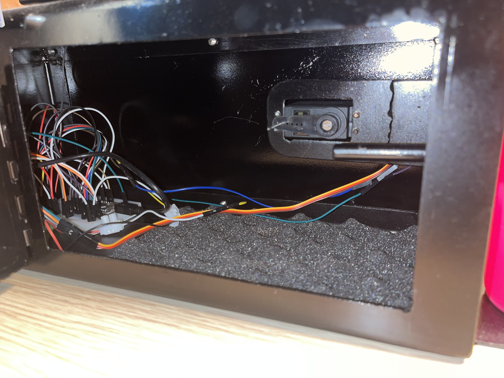

# Smart Alarm with Morning Challenge and Water Spray

This smart alarm project ensures you're fully awake and ready to start the day. Place your phone in a secure compartment the night before, and when the alarm goes off in the morning, it won’t stop until you solve a math challenge on the keypad. An ultrasonic sensor detects when you're in front of the alarm, activating a water spray to ensure you’re paying attention.

## How It Works

- **Ultrasonic Sensor**: Detects when you are in front of the alarm in the morning. Only then does it activate a pump to spray water, adding an extra wake-up effect.
- **Keypad Challenge**: The alarm displays a randomized math problem on the LCD. Three random numbers between 1 and 100 appear, and you must enter the correct sum using the keypad. If the answer is wrong, you’ll have to retry until you get it right. This sequence must be completed **twice** to unlock the compartment and silence the alarm.
- **Servo-Controlled Lock**: The compartment remains locked until you solve both challenges. When you successfully complete the two math challenges, the servo unlocks the compartment, allowing access to your phone.

## Emergency Backup Access

For those worried about the alarm being too stubborn, there’s a backdoor for emergency access. This door is secured with 10 screws, so if you try to avoid solving the math problem by unscrewing it, you'll be wide awake by the time you’re finished!

## Components

1. **Arduino Board** (e.g., Arduino Uno or Nano): Manages system logic and timing.
2. **Ultrasonic Sensor**: Detects if you're in front of the alarm to trigger the water spray.
3. **LCD Display**: Shows the math challenge and countdowns.
4. **Keypad**: Enables you to input answers to stop the alarm.
5. **Servo Motor**: Controls the lock mechanism of the phone compartment.
6. **Pump**: Activated by the ultrasonic sensor to spray water for an extra wake-up push.

*Inside view of the compartment where the phone is securely stored.*

*Close-up of the servo-controlled lock mechanism.*

## How to Use

1. Place your phone in the compartment before bed. The compartment is securely locked by the servo.
2. In the morning, when the alarm goes off, stand in front of the alarm to activate the water spray.
3. Solve the math challenge displayed on the LCD:
   - Three random numbers between 1 and 100 will appear, and you must enter their sum using the keypad.
   - If you answer incorrectly, you’ll have to retry until you get the correct answer.
   - You must complete this challenge twice in a row to stop the alarm and unlock the compartment.
4. **Emergency Access**: If all else fails, you can access the backdoor secured by 10 screws. But be warned, by the time you unscrew them all, you’ll definitely be awake!

Initially, I created it as a pastime, but surprisingly, I saw that it actually worked. Now, every morning, I curse myself for coming up with this system.

